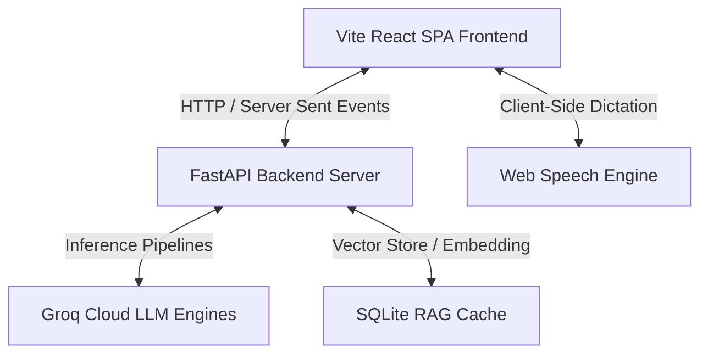

# 🌌 Nova AI — Enterprise-Grade Intelligent Agent Workspace

Nova AI is a premium, corporate-grade AI assistant platform built on a state-of-the-art visual design system. The system integrates blazing-fast LLM inference, real-time client-side streaming, automated voice execution consoles, an integrated RAG document catalog, and strict security shields blocking platform codebase extractions.

---

## 🏛️ System Architecture Overview

Nova AI is composed of two primary decoupling layers designed for high throughput, low latency, and aesthetic excellence:



---

## 💻 1. Frontend Architecture & Accomplishments

The frontend is built as a single-page application (SPA) focused on extreme visual luxury and user-friendly fluid mechanics.

### Key Implementation Areas:
1. **Premium Aesthetic & Visual System:**
   - Designed using a rich **glassmorphic** theme. Interfaces combine dark-space deep blue shades, harmonic HSL cyan and violet glows, custom premium typography (Outfit and Inter from Google Fonts), and smooth micro-animations powered by `framer-motion`.
2. **Siri-Style Voice Recorder & Auto-Submit Console:**
   - Integrated a gorgeous Siri-style dictation console directly inside the main `InputBar.tsx`.
   - Clicking the mic button collapses the text area, sliding in a sleek recorder bar with:
     * **Trash Button:** Left-aligned controller to completely cancel voice capture and return cleanly to standard text mode.
     * **Ticking Timer & Red Blinking Indicator:** Highly legible `MM:SS` duration ticker tracking recording lengths.
     * **Bouncing Soundwaves:** Organic multi-bar visualizer showing responsive bouncing colorful bars that simulate Siri sound mechanics.
     * **Pause/Play Toggles:** Interactive media controls to pause dictation and resume it dynamically without losing track.
     * **Green Send Arrow:** Right-aligned finishing circle that instantly triggers text transcription and submits the prompt to the AI.
   - **Voice Auto-Submit:** Once speech finishes, the hook automatically feeds the text into the active streaming query, immediately launching the response process without requiring manual mouse clicks.
3. **Inline Chat RAG History & Expanded Bottom Textbox:**
   - Removed the separate files shelf at the top to eliminate floating clutter and store files purely inside the active conversation.
   - When a document is ingested, it automatically triggers a visual announcement bubble inside the active chat history feed (`MessageBubble.tsx`) and initiates AI acknowledgment, sealing its presence cleanly in the chat timeline.
   - Restructured the chat `InputBar.tsx` layout to take up exactly **90% width** of the screen container and sit centered at the bottom, matching standard premium industry console formats.
4. **Authentication & User Onboarding:**
   - Clean registration and login interfaces supporting traditional email/password, a dedicated **OTP (One-Time Password)** generator tab, and **Google Account Login** authentication overlays.
   - Privacy terms modal popup overlays inside registration forms, giving users easy interactive compliance controls.
5. **PWA Mobile Viewport Notch Support:**
   - Injected notch viewport compatibility (`viewport-fit=cover`) and PWA standalone status bar parameters in `index.html`.
   - Programmed specialized postcss-friendly media queries in `index.css` to dynamically compress spacing and paddings on mobile viewports for perfect mobile-first alignment.
6. **Vercel Deployments Ready:**
   - Provided turn-key SPA routing configs in `vercel.json` to enable absolute compatibility for Vercel global hosting distributions.

---

## ⚙️ 2. Backend Architecture & Accomplishments

The backend is a high-speed asynchronous ASGI microservice layer optimized for processing multi-tenant requests and vectorized context generation.

### Key Implementation Areas:
1. **FastAPI Asynchronous Architecture:**
   - Clean routers dividing `/auth`, `/chat`, `/documents`, `/memory`, and `/voice` processes under unified schemas.
2. **LLM Orchestration via Groq Pipelines:**
   - Integrates directly with high-performance Groq API nodes (handling models such as `Llama-3.3-70b-versatile`, `Gemma2-9b-it`, `Mixtral-8x7b-32768`, etc.).
   - Utilizes custom task-based intent classifiers (`detect_task_purpose`) that dynamically adjust engine parameters:
     * **Coding Mode:** Ultra-low temperature (0.2) and specialized prompt engineering for logical code output.
     * **PPT Mode:** Structure answers into beautiful, visual slide outline segments.
     * **Summary Mode:** Factual TL;DR synthesis with hierarchical bullet structures.
     * **Word Mode:** Formal markdown heading arrangements.
     * **Image Mode:** Real-time dynamic visual render generation.
3. **AI Image Generation Pipeline (Direct Chat Rendering):**
   - Built a dynamic visual creation pipeline in `ollama_service.py` under `"image"` mode.
   - When the user asks the agent to create/draw/paint an image, the backend intercepts this intent and embeds a dynamic, high-quality **Pollinations AI markdown image URL** directly into the beginning of the streamed assistant response.
   - The frontend's markdown engine parses the markdown block instantly, rendering beautiful visual outputs right inside the chat bubble in real-time.
4. **Codebase Access Security Shield:**
   - Implemented security prompts and backend content inspection rules that completely safeguard Nova AI's own internal repository.
   - Any query attempting to crawl, download, or read local project file systems triggers a formal, encrypted security block:
     `[ACCESS RESTRICTED] Security Policy: Source code retrieval for the Nova AI platform is locked...`
5. **RAG Vector Search Store:**
   - Standalone text token dividers that split uploaded `.pdf`, `.docx`, and `.txt` materials into compact segments.
   - Creates mathematical token embeddings and computes cosine distances in real-time to augment user prompts with highly relevant institutional context.
6. **Intelligent Chat Session Title Generator:**
   - Designed and integrated an automated conversational title generator that summarizes new chat history.
   - Upon receiving the first user message, the backend calls Groq asynchronously using `generate_chat_headline` to craft a professional, 3-to-5 word title-cased headline representing the topic.
   - Automatically falls back to basic word-bounded truncation if the network request times out, ensuring zero friction.

---

## 📦 3. Project Dependency & Package Catalog

To support its visual excellence and high-speed asynchronous processing, Nova AI incorporates a carefully selected tech stack across the frontend and backend.

### 🎨 Frontend Packages (`frontend/package.json`)

| Package / Library | Version | Purpose |
| :--- | :--- | :--- |
| **react** | `18.3.1` | Declarative, component-based UI library. |
| **react-dom** | `18.3.1` | Entry point to the DOM and server renderers for React. |
| **react-router-dom** | `6.23.1` | Declarative routing for single-page applications. |
| **zustand** | `4.5.2` | Ultra-lightweight, fast state-management store. |
| **framer-motion** | `11.2.10` | Sleek animations and premium micro-interactions. |
| **gsap** | `3.12.5` | High-performance HTML5 browser animations. |
| **lucide-react** | `0.390.0` | Elegant, clean community-designed icon library. |
| **react-markdown** | `9.0.1` | Renders dynamic AI markdown streams cleanly. |
| **react-syntax-highlighter** | `15.5.0` | Beautiful syntax highlighting for code blocks. |
| **three** | `0.165.0` | High-performance WebGL 3D graphics library. |
| **@react-three/fiber** | `8.16.8` | React wrapper for 3D Three.js rendering. |
| **@react-three/drei** | `9.105.6` | Premium helpers and abstractions for React Three Fiber. |
| **axios** | `1.7.2` | Promise-based HTTP requests to FastAPI. |

#### Development Tools (Frontend)
* **Vite** (`5.2.13`) & **@vitejs/plugin-react** (`4.3.1`): Superfast bundler & dev server.
* **TypeScript** (`5.4.5`): Strict type checking for reliable coding.
* **TailwindCSS** (`3.4.4`), **Autoprefixer** (`10.4.19`), & **PostCSS** (`8.4.38`): Fluid styling pipelines.
* **gh-pages** (`6.1.1`): Seamless deployment directly to GitHub Pages.

---

### ⚙️ Backend Packages (`backend/requirements.txt`)

| Package / Library | Version | Purpose |
| :--- | :--- | :--- |
| **fastapi** | `0.111.0` | Extremely fast modern ASGI framework. |
| **uvicorn** | `0.30.0` | High-performance ASGI web server. |
| **python-dotenv** | `1.0.1` | Dynamic local environment variable configuration. |
| **pydantic** | `>=2.9.0` | Robust schema definition and input validation. |
| **pydantic-settings** | `>=2.5.0` | Settings management using Pydantic. |
| **supabase** | `2.4.6` | Client library for PostgreSQL data access. |
| **PyJWT** | `2.8.0` | JSON Web Token authentication credentials. |
| **bcrypt** | `4.1.3` | Multi-pass secure password hashing algorithm. |
| **python-multipart** | `0.0.9` | Request processing for files and forms. |
| **httpx** | `0.27.0` | High-speed async HTTP client for external integrations. |
| **langchain** | `>=0.2.17` | Standard library for structuring LLM workflows. |
| **langchain-community** | `>=0.2.17` | Community extensions for vector & agent pipelines. |
| **chromadb** | `>=0.5.6` | Embeddings database for context-augmented RAG search. |
| **sentence-transformers** | `3.0.1` | Numerical text embedding calculations. |
| **PyPDF2** & **python-docx** | `3.0.1` / `1.1.2` | Document readers to parse files uploaded into RAG pipelines. |
| **openai-whisper** | `20231117` | High-fidelity audio transcription for local voice hooks. |
| **gTTS** | `2.5.1` | Google Text-to-Speech audio feedback rendering. |

---

## 🛠️ How to Set Up & Run the Project

### Prerequisites
- Python 3.10+
- Node.js 18+
- Groq Cloud API Key (Get a free key at [console.groq.com](https://console.groq.com/))

### 1. Running the Backend Server
1. Navigate to the backend directory:
   ```bash
   cd backend
   ```
2. Create and activate a Python virtual environment:
   ```bash
   python -m venv .venv
   # On Windows:
   .venv\Scripts\activate
   # On Mac/Linux:
   source .venv/bin/activate
   ```
3. Install dependencies:
   ```bash
   pip install -r requirements.txt
   ```
4. Configure environment variables. Copy `.env.example` to `.env` and fill in your API keys:
   ```env
   GROQ_API_KEY=gsk_your_groq_api_key_here
   SUPABASE_URL=your_supabase_project_url_here
   SUPABASE_KEY=your_supabase_anon_key_here
   ```
5. Run the FastAPI development server:
   ```bash
   uvicorn main:app --reload --port 8000
   ```

### 2. Running the Frontend SPA
1. Navigate to the frontend directory:
   ```bash
   cd ../frontend
   ```
2. Install npm dependencies:
   ```bash
   npm install
   ```
3. Copy `.env.example` to `.env` to configure your API connection points:
   ```env
   VITE_API_URL=http://localhost:8000
   ```
4. Launch the local dev server:
   ```bash
   npm run dev
   ```
5. Open your browser and navigate to `http://localhost:5173`.

---

## ☁️ Deploying Frontend to Vercel

The frontend is fully configured for continuous integration on Vercel:
1. Push your repository to GitHub/GitLab.
2. Link the repository inside Vercel.
3. Configure the **Build Command** to: `npm run build`
4. Configure the **Output Directory** to: `dist`
5. Vercel automatically reads [vercel.json](file:///e:/Nova/nova-ai/frontend/vercel.json) to handle routing rewrites correctly, ensuring page refreshes on path points work seamlessly!

ermaid
sequenceDiagram
    User->>FastAPI Backend: Submits a Prompt
    FastAPI Backend->>Personal Cache: Fetches past Learned Preferences & Rules
    FastAPI Backend->>Groq Cloud: Runs inference augmented with Learned Rules & RAG
    Groq Cloud-->>User: Streams real-time response chunks
    FastAPI Backend->>FastAPI Backend: Spawns Background Task (Asynchronous)
    Note over FastAPI Backend: Autonomous Self-Learning Engine analyzes recent exchange
    FastAPI Backend->>Personal Cache: Updates user profile with new rules/facts/corrections
Key Components Implemented:
Autonomous Learning Pipeline (memory_service.py):

Preference & Correction Extractor: Added learn_user_preferences inside 

memory_service.py
. This function takes the recent exchanges in a session and queries the Groq pipeline using a highly specialized meta-prompt to extract three key learning areas:
Explicit Rules: (e.g., "Always write Python with type annotations" $\rightarrow$ "Always write code using Python type annotations.")
Personal Facts: (e.g., "My name is Alex" $\rightarrow$ "User's name is Alex.")
Self-Corrections: (e.g., "You made a mistake, that parameter should be optional" $\rightarrow$ "Self-Correction: Treat Y as optional in API X.")
Secure Local Cache: Automatically reads, appends, and deduplicates these learned facts in a local secure JSON database (vectorstore/user_learnings.json) mapped uniquely per user_id.
Zero-Latency Background Learners (chat_routes.py):

Spawns the preference extractor inside 

chat_routes.py
 as a non-blocking background task (asyncio.create_task) immediately after a message finishes streaming. This ensures the user experiences zero lag or wait times!
Dynamic Prompt Augmentation:

In 

chat_routes.py
, the system automatically loads the user's compiled memory (get_user_learnings) and prefixes it as a strict instruction block in the active LLM system prompt:
markdown
[Self-Trained User Rules, Preferences & Factual Corrections]:
- User prefers brief explanations for code blocks.
- Self-Correction: When writing API X, treat parameter Y as optional.
- User's name is John.
The model immediately adapts to and executes your rules in subsequent messages!
How to test this live in the chat:
You can simply instruct Nova or correct a mistake in natural language:

Instruct a preference: "From now on, always explain code blocks briefly in bullet points."
Make a factual update: "Actually my name is Sarah, not Guest."
Correct a mistake: "You made a mistake, Qwen is developed by Alibaba, not OpenAI."
In the very next turn, the model will have trained itself on your feedback and will strictly adhere to your rules and remember your facts!

Please let me know if you would like to expand on this memory system or implement further capabilities!